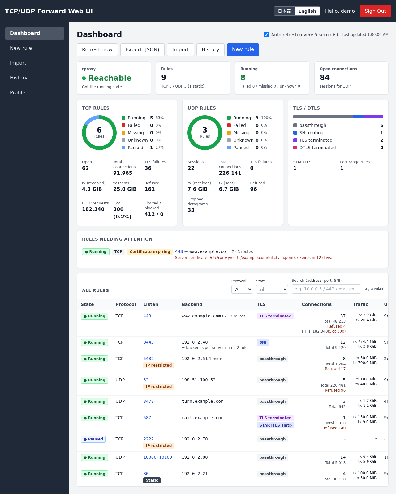
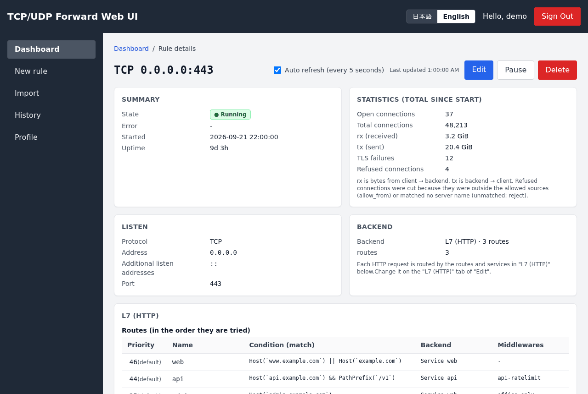
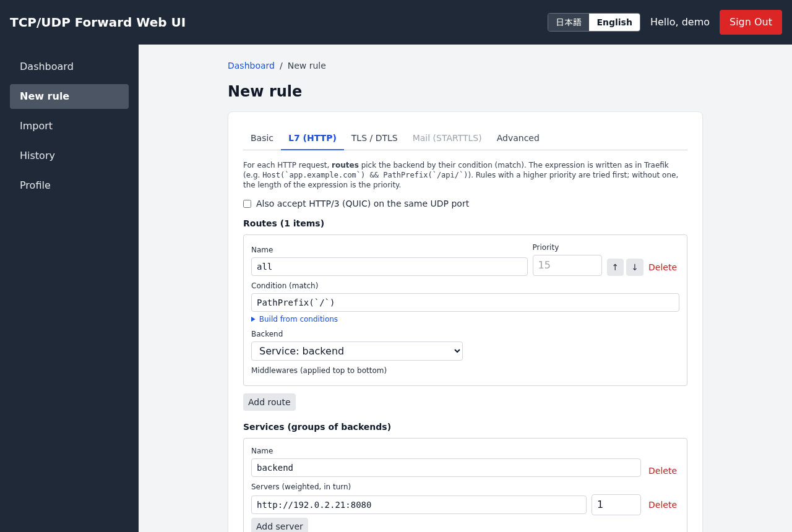
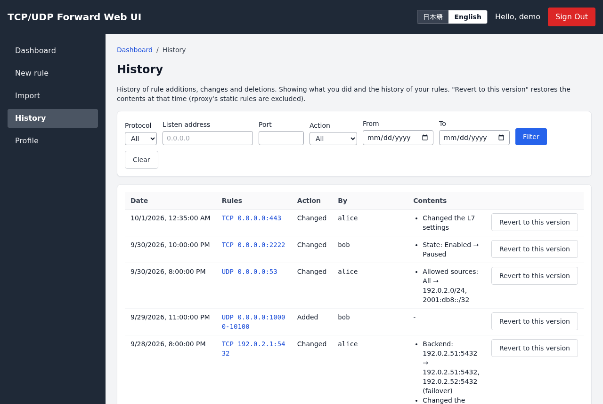
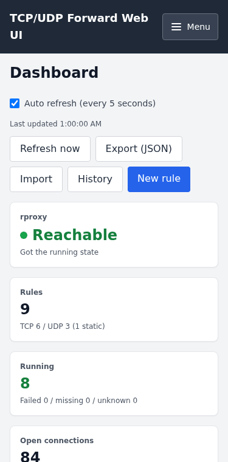
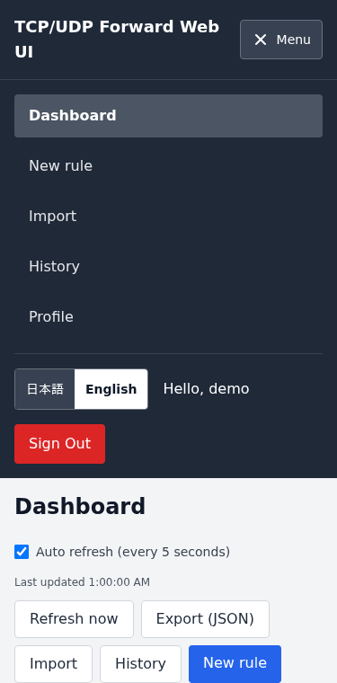

# TCP-UDP-rproxy-ui

[](https://github.com/max3584/TCP-UDP-rproxy-ui/actions/workflows/ci.yml)
[](https://github.com/max3584/TCP-UDP-rproxy-ui/releases/latest)
[](LICENSE)
[](https://nodejs.org/)
[](https://github.com/max3584/TCP-UDP-rproxy-ui/issues?q=is%3Aissue+is%3Aopen+%22Dependency+Dashboard%22)

日本語: [README.md](README.md)

A web UI for managing the forwarding rules of [rproxy-api](https://github.com/max3584/rproxy-api) (Next.js, sign-in with Keycloak, rules stored in MariaDB).
Versions are numbered independently of rproxy-api (the release notes state the minimum rproxy-api version the UI needs; see [docs/en/RELEASING.md](docs/en/RELEASING.md)).

## Screenshots



| Rule details (L7 routes, statistics) | Adding a rule (the L7 (HTTP) tab) |
|---|---|
|  |  |
| **Change history** | **Phone width (375px) and the menu** |
|  |   |

The data is documentation sample data (192.0.2.0/24, 198.51.100.0/24, 2001:db8::/32, example.com). To retake them, run `npm run build && npm run screenshots` (`scripts/screenshots/`; the API is replaced with sample data, so MariaDB, rproxy-api and Keycloak are not needed).

## Installation (Debian / Ubuntu)

It can be installed from the same apt repository as rproxy-api (`rproxy-ui`, a single package for any CPU).
Node.js 22.19.0 or later is required (Next.js 16 needs 20.9, and undici 8, used for Unix sockets, needs 22.19.0). Debian 13's standard nodejs is 20 and Ubuntu 24.04's is 18, which is not enough, so first install nodejs from [NodeSource](https://github.com/nodesource/distributions) with a fixed major version (24 below). An apt pin keeps the distribution's nodejs from being chosen.

```shell
NODE_MAJOR=24
sudo install -d -m 0755 /etc/apt/keyrings
sudo curl -fsSLo /etc/apt/keyrings/nodesource.asc https://deb.nodesource.com/gpgkey/nodesource-repo.gpg.key
echo "deb [signed-by=/etc/apt/keyrings/nodesource.asc] https://deb.nodesource.com/node_${NODE_MAJOR}.x nodistro main" \
  | sudo tee /etc/apt/sources.list.d/nodesource.list
printf 'Package: nodejs\nPin: origin deb.nodesource.com\nPin-Priority: 600\n' \
  | sudo tee /etc/apt/preferences.d/nodejs
sudo apt update && sudo apt install nodejs
node --version      # v24.x.x
apt policy nodejs   # the Candidate must come from deb.nodesource.com
```

- The steps are the same on Debian 13 and Ubuntu 24.04 (NodeSource's `nodistro` does not depend on the distribution). For 22, use `NODE_MAJOR=22` (22.19.0 or later)
- With the pin in `/etc/apt/preferences.d/nodejs` (priority 600), `apt install nodejs` replaces an already installed distribution nodejs with NodeSource's, and `apt upgrade` never goes back to the distribution's. NodeSource's nodejs includes npm (the distribution's `npm` package is not needed)
- `apt upgrade` only moves within the same major version. To change the major version, change `NODE_MAJOR`, rewrite `nodesource.list`, and run `sudo apt update && sudo apt install nodejs`

Then install rproxy-ui.

```shell
sudo curl -fsSLo /usr/share/keyrings/rproxy-archive-keyring.gpg https://max3584.github.io/rproxy-api/rproxy-archive-keyring.gpg
echo "deb [signed-by=/usr/share/keyrings/rproxy-archive-keyring.gpg] https://max3584.github.io/rproxy-api stable main" \
  | sudo tee /etc/apt/sources.list.d/rproxy-api.list
sudo apt update && sudo apt install rproxy-ui
```

- The settings are in `/etc/rproxy-ui/rproxy-ui.env` (600). Fill in `NEXTAUTH_URL`, `KEYCLOAK_*` and `DB_*`, then start it with `sudo systemctl enable --now rproxy-ui` (installing alone does not start it)
- `NEXTAUTH_SECRET` is generated at install time. If rproxy-api is on the same host, its API URL and its token file (`RPROXY_API_TOKEN_FILE=/etc/rproxy/tokens`, when it holds one token per line) are filled in too
- The `rproxy-ui` user joins the group `rproxy` shared with rproxy-api (created at install time if missing; the unit has `SupplementaryGroups=rproxy`), so it reads rproxy-api's group-readable files (token file, certificates, the control API's Unix socket, owned by `rproxy-api:rproxy` or `root:rproxy`) in place instead of copying them. A token copied into `RPROXY_API_TOKEN` by an earlier version keeps being used
- It listens on `127.0.0.1:3000` by default (`HOSTNAME` / `PORT`). To expose it, put an rproxy static rule in front of it (TLS termination, routing by server name, `allow_from`; see "Static rules and exposing the dashboard" in the rproxy-api README)
- Create the DB tables with `/usr/share/rproxy-ui/db/schema.sql` (see [db/README.en.md](db/README.en.md))
- `server.js` in `/usr/lib/rproxy-ui` (the Next.js standalone output) runs as the `rproxy-ui` user. Logs are in `journalctl -u rproxy-ui`
- The UI and rproxy-api have independent version numbers (their release tags differ). The UI needs rproxy-api v0.3.5 or later. The UI version and each node's rproxy-api version are shown at the bottom of the sidebar (the menu on narrow screens) and in "Versions" on the dashboard. When rproxy-api is too old or its version is unknown (releases before v0.3.18 do not report it), the dashboard shows a notice (a newer minor than the UI knows is only reported for information). The versions are also logged for each node at startup

## Development

First, run the development server:

```bash
npm ci        # install dependencies with npm (package-lock.json)
npm run dev
```

Required information:

+ NEXTAUTH settings
+ Database settings (`DB_PORT` defaults to 3306 when omitted)
+ Keycloak settings (a confidential client. Roles are read from the realm roles in the access token's `realm_access.roles`; see "Roles" below)
+ The URL and token of the rproxy-api control API (`RPROXY_API_TOKEN` is needed only when rproxy is started with `--token-file`)
  + If the rproxy tokens have permissions (YAML), the UI's token needs the scopes `rules:read` (list and details) and `rules:write` (add, change and delete). `metrics:read` is not used (`GET /capabilities` can be read with any token).
    With `allow_listen_ports`, rules whose listen ports are outside that range cannot be created, changed or deleted from the UI.
    If a scope is missing, the screen shows "The rproxy token used by the UI does not have permission for this operation" (it is also logged by the UI).
    Creating or changing rules with ACME certificates from the UI also needs `acme:write` (see "Obtaining certificates with ACME" below).

Environment:
```.env.local
NEXTAUTH_URL="http://[hostname]:[port]"
NEXTAUTH_SECRET="secret"

# database data
DB_HOST="[hostname]"
DB_PORT=3307
DB_DATABASE="[database]"
DB_USER="[username]"
DB_PASSWORD="[password]"

# Keycloak
KEYCLOAK_CLIENT_ID="[client_id]"
KEYCLOAK_CLIENT_SECRET="[client_secret]"
KEYCLOAK_ISSUER="https://[keycloak-host]/realms/[realm]"

# rproxy
RPROXY_API_URL="http://127.0.0.1:8080"
RPROXY_API_TOKEN="[token]"
# read the token from a file (RPROXY_API_TOKEN wins; the first non-empty line not starting with #; a changed file is used from the next request)
# RPROXY_API_TOKEN_FILE="/etc/rproxy/tokens"
# connect to an https:// control API with a client certificate (mTLS; rproxy-api v0.4 --tls-client-auth). The CA verifies rproxy's certificate (default: the OS CAs)
# RPROXY_API_TLS_CERT="/etc/rproxy-ui/tls/client.pem"
# RPROXY_API_TLS_KEY="/etc/rproxy-ui/tls/client.key"
# RPROXY_API_TLS_CA="/etc/rproxy-ui/tls/rproxy-ca.pem"
# usage accounting (see "Usage"; needs db/migrations/010_usage.sql and 011_usage_attr.sql): interval (seconds, 0 turns it off) and days to keep
# RPROXY_UI_USAGE_SECS=300
# RPROXY_UI_USAGE_HOURLY_DAYS=32
# RPROXY_UI_USAGE_DAILY_DAYS=400
# several rproxy instances (see "Several rproxy instances (nodes and groups)"). When set, RPROXY_API_URL / RPROXY_API_TOKEN are not used
# RPROXY_UI_NODES="/etc/rproxy-ui/nodes.yaml"
```

`RPROXY_API_URL` is an `http://` / `https://` URL, or `unix:/run/rproxy/api.sock` (the Unix socket of rproxy-api's `RPROXY_API_SOCKET`; the HTTP Host is `localhost`).
By default rproxy-api creates the Unix socket with mode 660, so add the user that runs the UI to the `RPROXY_API_SOCKET_GROUP` group (the token is still required, as with TCP).

The Keycloak realm can be created from `keycloak/realm-rproxy-dev.json` (load it in the admin console with "Create realm" → "Resource file").
The file contains no client secret and no users, so after loading it, check the secret under "Credentials" of the client `rproxy-ui` and set it as `KEYCLOAK_CLIENT_SECRET`. The URLs are for the con0 development environment (`http://con0.dev.home:3001`).

Register `${NEXTAUTH_URL}/api/auth/callback/keycloak` in "Valid redirect URIs" of the Keycloak client.

## Roles (permissions)

Keycloak roles decide who can do what (the API routes check on every request).

| Role | What it can do |
|---|---|
| `rproxy-admin` | List, view, change and delete the rules of all users (the list and details show the owner (Keycloak ID)). Can use any listen port |
| `rproxy-user` | Create, list, change and delete only their own rules. By default, regardless of roles, anyone who can sign in is treated this way (the same as up to v0.3.1) |
| Neither | Only when a role is made mandatory, e.g. `RPROXY_UI_USER_ROLE=rproxy-user`, neither the screens nor the API can be used (403; "You do not have permission" is shown) |

- Roles are read from the access token's `realm_access.roles` (realm roles). To use client roles, change the claim location (dot-separated), e.g. `RPROXY_UI_ROLES_CLAIM=resource_access.rproxy-ui.roles`.
- The role names are set by `RPROXY_UI_ADMIN_ROLE` (default `rproxy-admin`) and `RPROXY_UI_USER_ROLE` (empty by default). If `RPROXY_UI_USER_ROLE` is empty (the default), anyone who can sign in is treated the same as `rproxy-user` (operation without roles). With `RPROXY_UI_USER_ROLE=rproxy-user`, users without that role can no longer use it.
- Writing e.g. `RPROXY_UI_USER_PORTS=1024-65535` restricts the listen ports `rproxy-user` can use (outside the range: 403 `port_not_allowed`; `rproxy-admin` is not restricted). There is no restriction by default.
- With several rproxy instances, `RPROXY_UI_USER_NODES=node1,node2` limits the nodes `rproxy-user` can change (see "Several rproxy instances (nodes and groups)" below).
- Roles are read at sign-in, so after changing a role in Keycloak, have the user sign in again.
- State-changing APIs (`POST /api/forward/*`) refuse requests from other sites with 403 `csrf` (when `Sec-Fetch-Site` is not same-origin, or the host of `Origin` (else `Referer`) matches none of the request's `Host`, `X-Forwarded-Host` and `NEXTAUTH_URL`), as CSRF protection on top of the SameSite=Lax cookie. A reverse proxy in front should pass `Host` or `X-Forwarded-Host`, or set `NEXTAUTH_URL` to the URL users open.
- The `auth_id` in the history (`forward_rules_log`) is the user who performed the operation (the administrator, if an administrator changed someone else's rule).

## L7 (HTTP) rules

With rproxy-api v0.3.1 or later (`features.http` in `GET /capabilities` is true), choosing "Route by L7 (HTTP)" in the "Basic" tab of a TCP rule
lets you edit, in the "L7 (HTTP)" tab, the routes (`match` expressions as in Traefik; common conditions can be assembled by selection), services (targets and weights), middlewares (redirect, rate limit, CrowdSec, etc.; only the kinds rproxy supports) and the response when nothing matches.
The profiles "HTTPS reverse proxy (L7)" and "HTTP→HTTPS redirect (port 80, L7)" serve as templates. Switching between L4 and L7 is only possible at creation (rproxy cannot switch it with PATCH).
"Block sources banned by CrowdSec (L4)" in the "Advanced" tab can be used when the rproxy settings file has `global.crowdsec` (rproxy-api v0.3.2 or later).

For building a production environment (apt, DB users and privileges, Keycloak, publishing over HTTPS, updates and backups), see [docs/en/PRODUCTION.md](docs/en/PRODUCTION.md).

Table definitions and migrations are in `db/` (see [db/README.en.md](db/README.en.md)). On existing environments, apply `db/migrations/005_ranges_and_tls.sql` (columns for port ranges and TLS).
The HTTP API contract with rproxy-api is `../rproxy-api/docs/API.md`.

## Gateway API L7 and TLS fields

The rproxy-api fields for the Gateway API (rproxy-api #237; editable only when `features` of `GET /capabilities` reports them) can be created and edited in the form too.
With an rproxy that cannot use them, the fields are hidden, and values a rule already has are kept with a read-only note and sent as they are. The L7 view on the rule details shows them as well.

| Field | Where | features |
|---|---|---|
| Route time limits (whole request, one attempt to a backend) | Routes in the L7 tab | `route_timeouts` in `http_options` |
| Replace the Host, CORS, mirror (percentage or fraction) | Middleware kinds (`replace_host`, `cors`, `mirror`) | `middlewares` |
| Append headers (`add` in `request` / `response` of `headers`) | JSON of `headers` | `headers_add` in `http_options` |
| Redirect status code (301, 302, 303, 307, 308) | `redirect_scheme`, `redirect_regex` | `redirect_status` in `http_options` |
| Retry on status codes (`500`, `502-504`) | `retry` | `retry_status` in `http_options` |
| Middlewares per backend (only `headers`, `replace_host` and path rewrites) | Backend rows of a service | `server_middlewares` in `http_options` |
| Backends answering with a fixed status code (for their share by weight) | Backend kind "Answer with a status code" | `server_status` in `http_options` |
| HTTP version towards the backends (`http1`, `h2`, `h2c`, `auto`; h2 or h2c for gRPC) | Service | `protocol` in `services` |
| Backend TLS per service (server name, CA, SAN, client certificate, no verification) | Service | `tls` in `services` |
| Several destinations and balancing per server name | "Several destinations" of the per-name backends in the TLS tab | `tls_route_targets` |

Before saving, the form checks the same rules as rproxy (a URL or a status code, `h2` with https:// backends and `h2c` with http:// backends, the kinds of per-backend middlewares, the mirror's service, CORS origins, combinations of the service TLS, and so on).

## Multiple targets

"Add backend" in the "Basic" tab lets a rule have multiple backends, with a choice of "Load balancing" (rproxy-api v0.3.3 or later; L4 TCP / UDP rules).

| Load balancing | Behavior |
|---|---|
| Round robin | Rotates in turn in proportion to the weights |
| Least connections | Sends to the target with the smallest current connections (sessions for UDP) ÷ weight |
| Failover | Uses only the first live target from the top (when an upper target comes back, new connections go back to it) |

- Targets marked "Backup" are used only when all non-backup targets are down.
- A health check (checked by a TCP connection; interval, timeout, port) can be added. For UDP rules, the TCP port to check is required. Even without a health check, rproxy takes a target that failed to connect out of rotation for a while.
- The details screen shows the state of each target (up / down, connections) when rproxy returns it.
- For L7 rules, the same three can be chosen as the service's "Load balancing" (failover goes through the servers from the top).

## Listening on IPv4 and IPv6 at the same time

"Additional listen addresses" in the "Basic" tab lets the same port (range) be listened on at other addresses as well (rproxy-api v0.3.3 or later; up to 16).
You can list a representative IPv4 address together with a GUA IPv6 address, or specify `0.0.0.0` and `::` together. Statistics and logs are combined into one rule. The list shows "203.0.113.5:443 and 1 more (2001:db8::5)".

## Passing some server names through without termination (SNI passthrough)

In a rule that terminates TLS (including L7 rules), names set to "Do not terminate" under "Backends per server name" in the TLS tab are not terminated by rproxy; the connection is passed to the target as is, ClientHello included (the target's certificate is used; rproxy-api v0.3.3 or later).
For example, on `:443` rproxy can terminate cdn and gitlab and route them at L7, while passing registry and `**.tenant.example.com` straight to Kubernetes (with cert-manager certificates).

- One line can hold several server names separated by commas (rproxy's `server_names`).
- `*.example.com` matches exactly one level, `**.example.com` matches any number of levels (neither matches `example.com` itself). When several match, the order is: exact match → `*.` → `**.` (longer first) → the line higher up.
- In L7 rules, only "Do not terminate" lines can be used (other names are routed by L7 routes). "Disconnect" under "Connections matching no server name" cannot be used either.
- `allow_from`, CrowdSec and statistics also apply to passthrough connections.

## Routing UDP by server name (DTLS, QUIC)

UDP rules can also choose the target by the server name in the first packet when the TLS tab's mode is set to "sni" (from rproxy v0.3.8). rproxy v0.3.18 or later reports its version, so "sni" is not offered when it is older than v0.3.8 (an older rproxy that does not report its version still gets the choice, with a note that v0.3.7 or earlier refuses it when you save). Nothing is terminated, so no certificate is needed (the target has it). You can start from the profiles "Route HTTP/3 (QUIC) by server name (UDP 443)" and "Route TURN DTLS by server name (UDP 5349)".

- Only DTLS and QUIC (HTTP/3, etc.) can be routed. UDP whose packets carry no server name, such as IKE (IPsec), WireGuard, RTP and games, gets the "when nothing matches" handling (send to the basic target / drop).
- It cannot be combined with an L7 rule that accepts HTTP/3 (http3) on the same address and port (the form warns about this).
- QUIC connection migration (changes of the client's address) is not followed, and for ECH connections the real server name cannot be read.

## Obtaining certificates with ACME

From rproxy-api v0.3.21, rproxy can obtain certificates with ACME (Let's Encrypt and others) and renew them itself before they expire (`../rproxy-api/docs/en/ACME.md`).
On the TLS / DTLS tab, choose "terminate", then "+ Add ACME certificate" and give the resolver and the names (separated by commas or spaces). ACME certificates can sit next to file certificates.

- Accounts, DNS providers, resolvers, the names they may obtain (`allowed_names`) and the secrets (DNS API keys and so on) are written only in `global.acme` of rproxy's settings file (`RPROXY_CONFIG`).
  The screen reads only the resolver names, their challenges and the allowed names from rproxy's `GET /acme` (rproxy does not return secrets either) and lets you choose. Creating or deactivating accounts and renewing right away (`POST /acme/...`) are not on the screen (use rproxy's Unix socket).
- They can be chosen only for TCP termination, when rproxy supports ACME (`features.acme` of `GET /capabilities`) and its settings file has `global.acme`. With an older rproxy, ACME certificates are kept read-only and the screen says "This rproxy does not support ACME".
- Before saving, the names are checked with rproxy's rules: wildcards (`*.example.com`) only with a `dns-01` resolver, and names only within the `allowed_names` of the resolver's account (and DNS provider). When rproxy refuses (`400 invalid`), the reason is explained on the screen too.
- The UI's token needs the `acme:write` scope (without it rproxy refuses with 403, and the screen says so).
- Until the certificate is issued, rproxy serves a self-signed stand-in (`rproxy ACME placeholder`). The certificate section of the rule details shows the state (pending, valid, renewing, failed), the expiry, the renewal time (and the CA's renewal window (ARI) when it gives one), the next attempt, the last error, and whether the stand-in is being served.
- For dns-01 resolvers, the form shows the DNS provider type (PowerDNS, generic REST, RFC 2136, acme-dns; unknown types are shown by name) and a note (with acme-dns a new name is not issued until its CNAME is created). When a helper process (`rproxy-api acme-helper`) holds the secrets, the form says so (the secrets themselves are never shown).
- Certificates that cannot be obtained or keep failing to renew are listed under "Needs attention" on the dashboard (the reason and the next attempt; the days left when renewals keep failing within 14 days of expiry). The list shows "ACME failed" / "ACME pending" badges.
- Export and import write and read ACME certificates (`{"acme": "<resolver>", "domains": [...]}`) as they are.

## v0.4 rule settings (limits, bandwidth, GeoIP, labels)

The rproxy-api v0.4 settings (`../rproxy-api/docs/API.md`, "v0.4 settings") are edited on the "Limits & GeoIP" tab of the form. Only the items that rproxy reports in `GET /capabilities` `features` can be edited; on an rproxy that cannot run them the tab only explains (a value already set is kept read-only and sent as it is). All of them are optional and change without cutting connections.

| Item | What it does |
|---|---|
| Labels (`labels`) | Marks such as `tenant=act` (up to 16). They do not change behaviour; rproxy shows them in logs and `/metrics`, and the UI uses them for usage reports |
| L4 limits (`limits`) | Concurrent connections (UDP: sessions) of the whole rule and per source, new connections per source, UDP datagrams per source. Connections over a limit are closed before TLS and counted as "Refused by limits" |
| Bandwidth limits (`bandwidth`) | Upload and download of the whole rule and per source (like `10Mbps`). TCP waits, UDP drops what is over |
| GeoIP (`geoip`) | Allow and deny lists of countries (ISO 3166-1 alpha-2) and ASes. Needs `global.geoip` (MaxMind mmdb) in rproxy's settings file. L7 rules can also use the `geoip` middleware |
| Passive health checks (`outlier_detection`) | Ejects targets that keep failing for a while (L4 rules). L7 rules set it per service on the "L7 (HTTP)" tab |

- Values are checked with the same rules as rproxy before saving (ranges, units, combinations; rproxy decides in the end). They are also stored in the DB `options` column in rproxy's API shape, so a restarted rproxy comes back with the same contents.
- When rproxy reports `features.dry_run`, the add and edit screens show "Show the difference". Before saving, it asks rproxy with `?dry_run=true` what would change on each node (create or update, whether it changes without cutting connections or recreates the listener, and each field before and after) without changing the DB or rproxy.
- The detail screen shows the settings, the count refused by limits, when counting started (`counters_since`), which targets are ejected and how often, and rproxy's `conditions` (Gateway API style status), when rproxy reports them.
- "rproxy features & settings" (`/system`) shows, read-only and per node, the rproxy-api version, the v0.4 feature flags, which `global.performance` keys of the settings file take effect, and the settings file state. Performance, GeoIP databases and control API hardening are changed in rproxy's settings file and arguments (not from the UI). The settings file path and error text, the binary's SHA-256 and the reasons a node cannot be reached are shown to administrators only (users see that there is an error or a failure); users limited by `RPROXY_UI_USER_NODES` see only their nodes (the same applies to the dashboard's settings file notice).
- To protect the control API with client certificates (mTLS), set `RPROXY_API_TLS_CERT` and `RPROXY_API_TLS_KEY` (and `RPROXY_API_TLS_CA` to verify rproxy's certificate), or `tls_cert`, `tls_key` and `tls_ca` in `nodes.yaml` for several rproxy instances (`https://` URLs only; when the token file entry has only `client_cert`, no token is needed). With `RPROXY_API_TLS_*` and an `http://` or `unix:` `RPROXY_API_URL`, the token would travel in plain text, so the UI does not start (and sends no request).
- When rproxy temporarily locks the UI out after repeated authentication failures (`429 locked_out`), the screen and the log say to check the token and certificate (the lockout ends by itself).

## Usage

| Screen | Contents |
|---|---|
| Dashboard (`/`) | Whether rproxy is reachable, the number of rules (including static rules), a card per TCP / UDP (donut of running, failed, missing and unknown, connections, total connections, rx / tx, TLS failures, denied), the TLS breakdown, rules that need attention, and a table of all rules (filter by protocol, state and search; select a row to open its details; static rules are marked "Static" and rules that restrict the source are marked "IP restricted"). Refreshes automatically every 5 seconds (can be toggled) |
| New rule (`/rules/new`) | The add form |
| Rule details (`/rules/{tcp\|udp}/{listen address}/{port}`) | Settings, live state and statistics. "Edit" and "Delete" (not available for static rules) |
| Edit (details URL + `/edit`) | The change form |
| Import (`/rules/import`) | Load rules from YAML / JSON (see "Export and import" below) |
| Change history (`/history`) | History of adding, changing and deleting rules, and reverting to an earlier version (see "Change history and revert" below). The rule details screen also shows the history of that rule |
| Usage (`/usage`) | Traffic report per month or day (grouped by owner, label, node or rule) with CSV, and traffic over time (see "Usage" below) |
| rproxy features & settings (`/system`) | Per node: the rproxy-api version, v0.4 feature flags, which `global.performance` keys take effect, the settings file state (read-only) |

rx is the number of bytes from the client to the target, tx from the target to the client (cumulative since rproxy started the rule; reset to 0 when rproxy restarts).
"Refused" is the number of connections dropped because they were outside the allowed sources (allow_from), or because of the setting that drops connections matching no server name (unmatched: reject).

Static rules are the rules in the file rproxy loads at startup (`RPROXY_STATIC_RULES` / `--static-rules`; "Static rules" in `../rproxy-api/docs/API.md`) and are not stored in the DB.
They are shown on the dashboard and details screens to anyone who is signed in, but cannot be changed or deleted from the screens (edit the file and restart rproxy).

The form is divided into tabs.

| Tab | Contents |
|---|---|
| Basic | Profile (templates by use case), protocol, listen address, port (the end of a range is optional), target |
| L7 (HTTP) | Routes, services, middlewares and "When no route matches" (L7 rules; TCP, when rproxy supports L7) |
| TLS / DTLS | passthrough / sni / terminate (DTLS for UDP), backends per server name and "Connections matching no server name" (Send to the default backend / Disconnect), certificates, TLS options (minimum version and cipher suites; TCP terminate), client certificate verification (mTLS), ALPN, re-encryption to the backend |
| Mail (STARTTLS) | STARTTLS for SMTP / IMAP / POP3 (only for TCP with "terminate") |
| Limits & GeoIP | Labels, L4 limits, bandwidth limits, GeoIP, passive health checks (rproxy-api v0.4; see "v0.4 rule settings" above) |
| Advanced | Source IP handling (source_ip), UDP idle timeout, allowed sources (allow_from) |

- A profile only fills the form with the recommended settings from `../rproxy-api/docs/PROFILES.md`. Enter the addresses and certificate paths for your environment.
- The certificate, private key and CA paths are paths on the rproxy-api server. If they cannot be read, you get a `tls_config` error.
- rproxy-api only reads certificate, private key, CA and secret (htpasswd and so on) files owned by the OS user it runs as (`rproxy-api` with the package), so nobody can name another user's key and connect or listen with that identity. Read access for the `rproxy` group is fine (for example `chown rproxy-api:rproxy`, `chmod 0640`). With another owner rproxy refuses the file, and the screen explains why and how to fix it.
- Specify certificates as files (obtained with certbot, cert-manager or similar) or with ACME (from rproxy-api v0.3.21; see "Obtaining certificates with ACME" below).
  For files, rproxy checks whether the files changed every 60 seconds (rproxy's `RPROXY_CERT_CHECK_SECS`) and reloads renewed certificates automatically, so you do not need to edit the rule on every renewal.
- Intermediate CAs (optional) go in one PEM file, ordered from the CA that issued the server certificate toward the root (the root is not needed). If the order is wrong, rproxy rejects it with `tls_config`.
  For client certificate verification, specify the root CA (trust anchor) in the CA file and the intermediate CA that issued the client certificates as the intermediate CA. Intermediate CAs can also be specified for the client certificate sent to the target.
- A port range (e.g. `8000-8001`) forwards each port in turn starting from the target port. The upper limit is rproxy's `max_range_ports` (default 20000). The range and the source IP handling cannot be changed after creation (TLS settings can be changed).
- WebRTC media cannot connect if DTLS is terminated. Use a passthrough range rule.
- Allowed sources (allow_from) take one entry per line, a CIDR (`172.16.0.0/16`, `fd00::/8`) or a single IP (up to 64). If empty, everything is allowed.
  TCP connections from outside the range are dropped before TLS or the PROXY header, and for UDP, datagrams from sources outside the range are discarded. On save they are normalized, e.g. `10.0.0.5` → `10.0.0.5/32`.
- "Connections matching no server name" can be chosen only for sni (TCP / UDP) or TCP terminate with backends per server name. "Disconnect" drops connections with an unmatched name or without SNI (with terminate, they are dropped without completing the handshake).

## Rules created through the rproxy API

Rules created by calling the rproxy API directly (CI, scripts, Kubernetes controllers; not in the UI's DB) appear with an "API" badge on administrators' (`rproxy-admin`) dashboards and detail screens (#76; users do not see them).

- rproxy-api v0.4 stores the rules created with a `persist: true` token in its own table `rproxy_rules` (`db/migrations/009_rproxy_rules.sql`, in the UI's DB) and reports `origin: "api"` with the creating token and time. The UI reads rproxy's `GET /rules` and `rproxy_rules`, and shows stored rules that are not running in rproxy as "missing". Rules that are not stored show "API (not stored)" (they disappear when rproxy restarts).
- Edit and delete go through the rproxy API (`PATCH` / `DELETE`); nothing goes into the UI's DB or history, and there is no pause, copy or resend. Changes to and deletion of a stored rule (`origin: "api"`) are written to `rproxy_rules` by rproxy even though the UI's token has no `persist` (rproxy decides by the rule's origin). Only when rproxy could not store it (`persisted: false` in the answer) does the UI say a restart brings back the earlier contents. "Show the difference" works when rproxy reports `features.dry_run`.
- Rules of a rule set (`ruleset`, applied as a whole with `PUT /rulesets/{name}` by e.g. a Kubernetes controller) show a "Set: name" badge and are read-only (rproxy also refuses changing them one by one with `409 owned`).
- When an API rule or a rule-set rule in rproxy uses the same key as a UI rule (so the UI rule is not running), the detail screen warns. rproxy prefers the UI's table at startup; delete one of them or change the key.
  Until then, changes, resumes, resends and diffs of the UI rule are not sent to rproxy (`409 shadowed`), and pausing or deleting it changes only the UI's DB (operations on the UI rule never change or delete the API rule). The automatic act / stb resend skips that key too and only reports it as overlapping an API rule (promotion is not blocked). Users other than administrators do not see the destination, statistics, state, creating token or rule-set name of the rule running under that key.
- With several rproxy instances, match rproxy's `RPROXY_NODE_NAME` with the node names in `RPROXY_UI_NODES` (the `node` column of `rproxy_rules`). The per-node views (`db/node-view.mjs`) also create an `rproxy_rules` view that can write only that node's rows.

## Pausing a rule

"Pause" on the rule details screen (or on the row in the list) stops a rule without deleting it. "Resume" runs it again with the same contents.

- Pausing keeps the rule in the DB and removes it from rproxy (the listener closes and existing connections are cut). Paused rules are not created even when rproxy restarts (from rproxy-api v0.3.5; it reads `"enabled": false` in the DB's `options` and skips them).
- Paused rules can still be edited (only the DB changes, and the rule is created with those contents on resume). Deleting also touches only the DB.
- The list, details and dashboard show "Paused" and count them separately.
- Pause and resume are recorded in the history as "Changed" (the difference shows whether it is paused).
- Exports add `enabled: false` to paused rules (importing restores them as paused). This field is only valid within the UI's export format.
- "Replace" on import and reverting from the history keep the current paused / running state (only the contents change). Reverting a deleted rule recreates it in the state of that version (paused if it was paused).

## Export and import

"Export (JSON)" on the dashboard writes your rules (for `rproxy-admin`, the rules of all users) as JSON (for UI backups and migration).

```json
{"format": "rproxy-ui-export", "version": 1, "exported_at": "...", "rules": [{"protocol": "tcp", "listen_addr": "0.0.0.0", ...}]}
```

- The fields of each rule have the same names as in rproxy's API and settings file (`remote_addr`, `tls`, `http`, `targets`, etc.). Fields with default values (`source_ip: proxy`, `udp_idle_secs` for TCP, `tls` for passthrough, etc.) are omitted. Paused rules get `enabled: false`.
- The leading `format` distinguishes the file from an rproxy settings file. rproxy does not know this field, so even if the exported file is placed as `RPROXY_CONFIG`, it is not loaded by mistake but rejected (when moving to a settings file, use the contents of `rules` and remove paused rules and `enabled`).
- `rproxy-admin` can export only a specific user's rules with `/api/forward/export?owner=<user ID>`.

"Import" (`/rules/import`) loads a UI export (JSON) or an rproxy settings file (YAML / JSON; `version: 1` and `rules:`, or an array of rules). It can also be used to move rules written in a settings file under UI management.

1. "Check" validates each rule the same way as adding it from the screen, and shows the results (add / same key exists / error) in a table. Nothing is changed yet.
2. For rules whose key (protocol, listen address, port) already exists, you can choose "Replace" per row (skipped if not chosen).
   The same key as another user's rule, the same key as an rproxy static rule, and keys that overlap within the loaded content are errors.
3. "Import" adds / replaces the rules one by one. If it fails partway, the successful ones remain (the result is shown per row).

- `global` (CrowdSec, trusted_proxies, etc.) is an rproxy-side setting, so it is skipped.
- On replace, a rule that differs in source IP handling, port range or L4 / L7 is deleted and recreated (existing connections are cut).
- The `RPROXY_UI_USER_PORTS` restriction applies to imports as well.
- Additions and replacements are recorded in the history, the same as operations from the screen.

## Change history and revert

"History" (`/history`) shows the history of adding, changing and deleting rules (when, who, what). Changes show the difference from the previous version (target, TLS mode, allowed sources, etc.).
You can filter by protocol, listen address, port, operation and period (`rproxy-admin` can also filter by the user who performed the operation). The rule details screen also shows the history of that rule.

- What you can see: users see the history they performed and the history of the rules they currently own. `rproxy-admin` sees everything.
- "Revert to this version" restores the contents at that point. For change and add rows it restores the contents after that operation; for delete rows, the contents just before deletion.
  If the rule still exists it is replaced (a version that differs in source IP handling, port range or L4 / L7 is recreated); if it was deleted it is recreated. Reverts are also recorded in the history.
- rproxy static rules are not in the DB, so they do not appear in the history (a revert is not possible when a static rule with the same key exists).
- The history is the DB's `forward_rules_log`. No columns were added, so no migration is needed.

## Usage (traffic accounting)

rproxy's statistics (connections, rx / tx) go back to 0 when rproxy restarts, so every `RPROXY_UI_USAGE_SECS` (default 300 seconds, 0 turns it off) the UI reads each node's `GET /rules` and stores the difference from the previous reading in the DB (#101; `db/migrations/010_usage.sql`; without it nothing is collected).

- Stored per rule and node hourly (`usage_hourly`, `RPROXY_UI_USAGE_HOURLY_DAYS` days, default 32) and daily (`usage_daily`, `RPROXY_UI_USAGE_DAILY_DAYS` days, default 400); months add up the daily rows. Buckets follow UTC. The UI deletes old rows.
- When rproxy v0.4's `stats.counters_since` (when counting started) changes, the counters were reset and the current values are added in full (a live upgrade (handoff) keeps it, so counting continues). Older rproxy versions are told apart by `started_at`.
- Each row records the rule's owner at that time (the user who created the UI rule), node / group, labels (`labels`) and origin (UI, static, API). When the owner or marks change (someone else creates a rule with the same key on the same day, an administrator reassigns it, labels change), new traffic goes to a separate row and earlier traffic is never moved to the new owner (`db/migrations/011_usage_attr.sql`).
- Why collection failed (for example a node's rproxy could not be reached) is shown to administrators only (users see that it failed). The CSV puts `'` before values a spreadsheet would read as a formula (`=`, `+`, `-`, `@`, `|`, `%` after leading spaces, full-width `＝`, `＋`, `－`, `＠` and so on).
- Rule details and the dashboard show a traffic chart (24 hours, 7 days, 30 days, 12 months; rx and tx stacked, also as a table), and "Usage" (`/usage`) shows a report per month or day (grouped by owner, a label key, node or rule) with CSV export. Administrators see all rules, users only their own.
- With several UI instances, each collection runs in only one of them (a DB lock).

## Several rproxy instances (nodes and groups)

One UI can manage several rproxy instances (**nodes**) (#98; this version lays the foundation). Nodes that carry the same rules form a **group** (active / standby is a group too; showing the roles comes in a later version).
A rule belongs to a node or a group. Adding, changing, deleting, pausing, resuming, importing and reverting a group's rule is sent to every node of the group. If one node fails, the change is undone on the nodes that succeeded and the DB is left unchanged (the response's `nodes` has the result per node).

Without `RPROXY_UI_NODES`, the UI works as before with the single rproxy of `RPROXY_API_URL` / `RPROXY_API_TOKEN` (no change to the settings or the DB; the screens look the same).

```yaml
# /etc/rproxy-ui/nodes.yaml (RPROXY_UI_NODES=/etc/rproxy-ui/nodes.yaml; YAML or JSON)
nodes:
  - name: node1                      # up to 32 lowercase letters, digits or _ (node and group names must all differ)
    url: http://10.0.0.11:8080       # http(s):// or unix:/run/rproxy/api.sock
    token_file: /etc/rproxy-ui/tokens/node1   # tokens are read from files (never stored in the DB)
    # tls_cert: /etc/rproxy-ui/tls/node1.pem  # client certificate (mTLS) for an https:// url (with tls_key; tls_ca is rproxy's CA)
    # tls_key: /etc/rproxy-ui/tls/node1.key
  - name: node2
    url: http://10.0.0.12:8080
    token_file: /etc/rproxy-ui/tokens/node2
groups:
  - name: ha
    nodes: [node1, node2]
    mode: active_standby             # single (default) or active_standby
    vip: 192.0.2.10                  # the active_standby VIP (optional; may be a list; see "act / stb" below)
    auto_resend: true                # the UI resends to a drifted stb automatically (default true; #109)
default_target: ha                   # chosen first on the add screen (optional; automatic with one node)
```

- The file is checked when the UI starts; if it is wrong, the reason is logged and the UI does not start. Restart the UI after changing it. The user running the UI (`rproxy-ui` with the .deb) must be able to read the token files.
- With two or more nodes, the add screen has a "Node / group" choice, and the list and the detail show the node / group. A group rule's state is the worse one (failed > missing > unknown > running); connections and traffic are summed.
- The dashboard and the rule detail get "All / per node" tabs (no tabs with a single node). A node's tab shows that node's state, connections, rx / tx, denied, HTTP request counts and certificate expiry; "All" shows the totals and a table comparing the nodes (act and stb traffic side by side; on the dashboard also reachability, rules, failures and drift counts).
- **Drift**: the rule running on each node (`GET /rules`) is compared with the UI's definition (the DB), and differing fields (destination, TLS, allow_from, etc.; runtime figures are not compared) are shown as "Drift". "Resend to this node" on a node's tab of the rule detail sends the UI's definition to that node only (differences PATCH cannot fix (source IP handling, port range, L4 / L7) recreate the rule; a rule missing on the node is created; a paused rule still running is removed). Only the rule's owner and admins can use it, and the history records "Resend" (`RESEND`) with the node.
- **act / stb**: in an active_standby group, the node whose `GET /interfaces` has the VIP is shown as act, the others as stb. The VIP is the group's `vip`, or, without it, the rule's listen address (when it is not `0.0.0.0`, `::` or loopback). stb does not hold the VIP, so rules usually listen on `0.0.0.0` (without `ip_nonlocal_bind` stb cannot bind the VIP); setting `vip` is recommended. A warning is shown when no node or several nodes hold the VIP.
- The dashboard's rproxy settings-file warning covers every node, each prefixed with the node name. The node list also shows when each node was last applied to (from the history).
- **Per-node overrides**: even for a group rule, "Settings for this node only (override)" on a node's tab of the rule detail changes the listen address (and the additional listen addresses), the destination (one destination or multiple targets) and the allowed sources, and can pause the rule on that node only (TLS, L7, source IP handling and the port range stay the same across the group). Saving applies it to that node only, right away, and the history records "Node override" (`OVERRIDE`) with the node. Drift checks and resends compare with the overridden contents. The per-node views apply the overrides too, so a restarted rproxy comes back with the same contents. Exports carry them as `overrides` (a UI-export-only field), and importing into a group restores them.
- **Copy / move**: "Copy / move" on the rule detail creates the same rule on another node or group (move deletes the original). Copying to a destination sharing nodes gives 409 `target_conflict`; moving there deletes the original first and then creates the rule (restoring the original if that fails). Overrides are kept only for nodes that are also in the destination; when placing the rule on a node, that node's override becomes the rule's contents. The history records the add (and, for a move, the delete).
- **Per node**: "Pause all / Resume all" on a node's tab of the dashboard pauses or resumes all of that node's rules (rules on that node as a whole, group rules on that node only). The scope (node / group) can be chosen next to "Export".
- **Syncing before an act / stb promotion** (#109): so that a stb that drifted from act (= the DB definition) is not promoted as is,
  - the UI checks active_standby groups every `RPROXY_UI_HA_SYNC_SECS` (30 seconds by default; 0 stops it) and resends drifted / missing rules automatically (the history records "Resend" by `system`). `auto_resend: false` on a group only shows the drift. After 3 failures in a row the dashboard shows a warning. With several UIs running, a DB lock makes only one of them run each check.
  - endpoints for keepalived (instead of a Keycloak session, they take a token from `RPROXY_UI_HA_TOKEN_FILE` (one per line) as `Authorization: Bearer`; 404 when it is not set): `GET /api/forward/ha/ready?node=` (200 when in sync, 503 with the details otherwise) and `POST /api/forward/ha/notify?node=&state=MASTER` (resends to the node right after it is promoted).
  - scripts and an example configuration are in `contrib/keepalived/` (`/usr/share/doc/rproxy-ui/examples/keepalived/` with the .deb). The track_script lowers the priority only on 503 and does nothing when the UI cannot be reached (if act fails, the stb is promoted even when not in sync).
  - the "act / stb" screen (`/ha`; administrators only; opened from the dashboard's node list) shows each group's act and whether each node is in sync, and "Sync this node" resends. It also guides going back to the original act (failback). keepalived moves the VIP.
- **Node-scoped roles**: `RPROXY_UI_USER_NODES=node1,node2` limits the nodes `rproxy-user` can change (a group only when all its nodes are listed; otherwise 403 `node_not_allowed`; the add screen's choices are limited too). `rproxy-admin` is not restricted. No restriction by default.
- Rules with the same key (protocol, address, port) can be put on nodes / groups that share no node (otherwise 409 `target_conflict`).
- Apply `db/migrations/006_nodes.sql`, `007_log_node.sql` (the node of a resend in the history) and `008_overrides.sql` (per-node overrides; recreate the per-node views afterwards) and `009_rproxy_rules.sql` (rproxy-api v0.4 API rules) before using it (a `target` column in `forward_rules` and `forward_rules_log`, and the `forward_rule_targets` table). Existing rules belong to `default`: name a node `default` in the file, or move them with `UPDATE forward_rules SET target = 'node1' WHERE target = 'default'`.

### Restoring at rproxy startup (a view per node)

rproxy reads the whole `forward_rules` at startup, so each node gets its own database containing a view named `forward_rules` with only the rows of that node and of the groups containing it (rproxy is not changed).
`db/node-view.mjs` prints the SQL (`/usr/share/rproxy-ui/db/node-view.mjs` with the .deb). Run it as an administrator who can read the UI's tables.

```bash
node db/node-view.mjs node1 --database rproxy --host 10.0.0.11 --password '<password>' | mariadb -u root -p
# rproxy on node1: RPROXY_DATABASE_URL=mysql://rproxy_node1:<password>@<DB host>/rproxy_node_node1
```

The view filters through `forward_rule_targets` (rewritten by the UI to match the file), so changing groups needs no new view (run it only for a node you add). See `db/README.en.md`.

## Backup and restore

The source of truth for the UI's rules is the DB's `forward_rules` (the history is `forward_rules_log`). Besides the DB, back up `/etc/rproxy-ui/rproxy-ui.env` (`NEXTAUTH_SECRET`, `KEYCLOAK_CLIENT_SECRET`, `DB_PASSWORD`, `RPROXY_API_TOKEN`) and `/etc/rproxy` on the rproxy side.
How to take backups (`mariadb-dump --single-transaction`, a systemd timer example), the restore order, checks after restoring (comparing rproxy's `GET /rules` with the DB), moving to a new host, and running rproxy alone when the DB is broken are described in [docs/en/BACKUP.md](https://github.com/max3584/rproxy-api/blob/master/docs/en/BACKUP.md) of rproxy-api.
"Export (JSON)" also works as a copy of the rules (see "Export and import" above).

## Tests

```bash
npm test
```

The list of tests, and how to run the E2E tests that use a real MariaDB and rproxy-api (`RUN_E2E=1`), are in [docs/en/TESTING.md](docs/en/TESTING.md).
