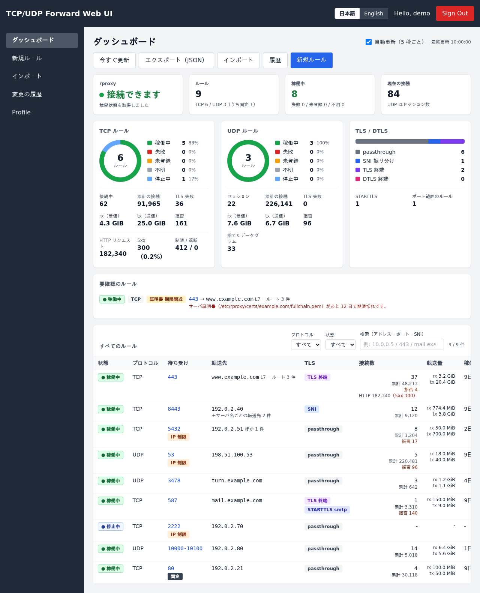
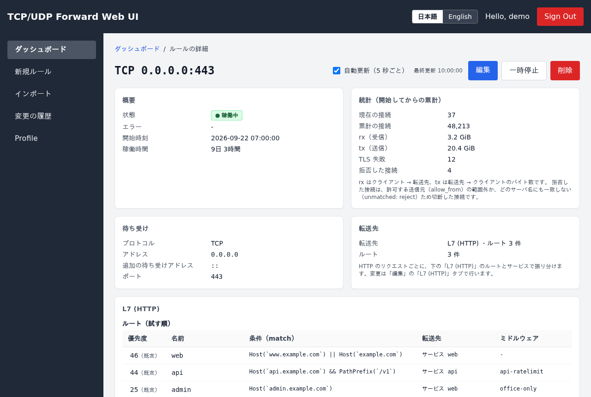
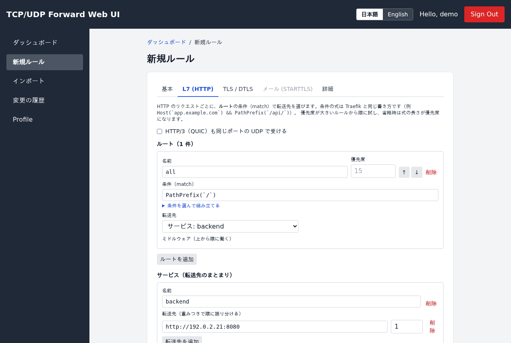
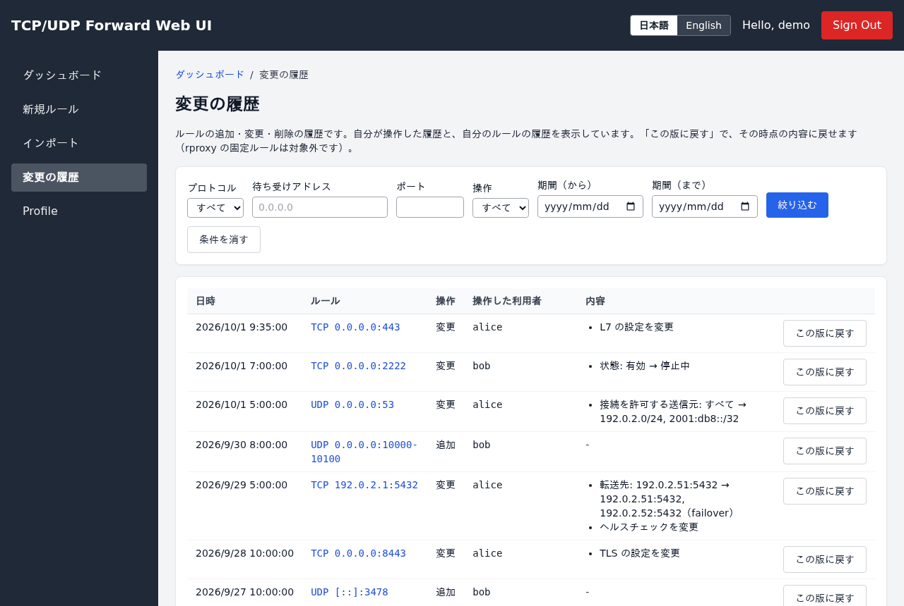
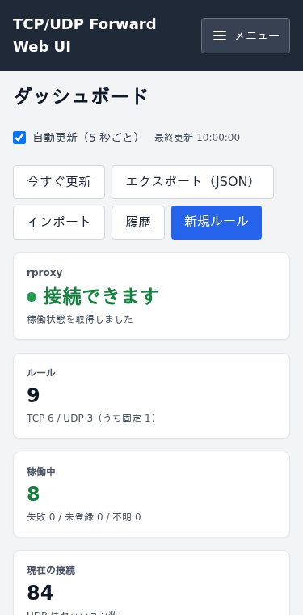
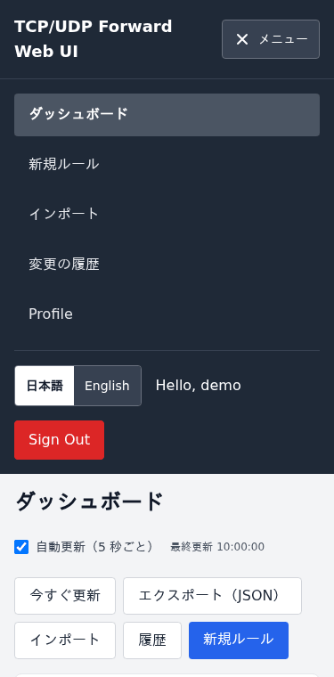

# TCP-UDP-rproxy-ui

[](https://github.com/max3584/TCP-UDP-rproxy-ui/actions/workflows/ci.yml)
[](https://github.com/max3584/TCP-UDP-rproxy-ui/releases/latest)
[](LICENSE)
[](https://nodejs.org/)
[](https://github.com/max3584/TCP-UDP-rproxy-ui/issues?q=is%3Aissue+is%3Aopen+%22Dependency+Dashboard%22)

English: [README.en.md](README.en.md)

[rproxy-api](https://github.com/max3584/rproxy-api) の転送ルールを管理する Web UI（Next.js、Keycloak でサインイン、ルールは MariaDB に保存）。
バージョンは rproxy-api と別々に進める（UI が動くのに必要な rproxy-api の最小の版はリリースノートに書く。docs/RELEASING.md）。

## 画面



| ルールの詳細（L7 のルート・統計） | ルールの追加（L7 (HTTP) のタブ） |
|---|---|
|  |  |
| **変更の履歴** | **スマホの幅（375px）とメニュー** |
|  |   |

中のデータは文書用のサンプル（192.0.2.0/24・198.51.100.0/24・2001:db8::/32・example.com）。撮り直すには `npm run build && npm run screenshots`（`scripts/screenshots/`。API をサンプルのデータに差し替えるので、MariaDB・rproxy-api・Keycloak は要らない）。

## インストール（Debian / Ubuntu）

rproxy-api と同じ apt リポジトリから入れられる（`rproxy-ui`、CPU を問わない 1 つのパッケージ）。
Node.js 22.19.0 以上が要る（Next.js 16 は 20.9、Unix ソケットに使う undici 8 は 22.19.0 から）。Debian 13 の標準の nodejs は 20、Ubuntu 24.04 は 18 で足りないので、先に [NodeSource](https://github.com/nodesource/distributions) の nodejs をメジャー版を指定して入れる（下は 24）。apt の pin で、ディストリの nodejs は選ばれないようにする。

```shell
NODE_MAJOR=24
sudo install -d -m 0755 /etc/apt/keyrings
sudo curl -fsSLo /etc/apt/keyrings/nodesource.asc https://deb.nodesource.com/gpgkey/nodesource-repo.gpg.key
echo "deb [signed-by=/etc/apt/keyrings/nodesource.asc] https://deb.nodesource.com/node_${NODE_MAJOR}.x nodistro main" \
  | sudo tee /etc/apt/sources.list.d/nodesource.list
printf 'Package: nodejs\nPin: origin deb.nodesource.com\nPin-Priority: 600\n' \
  | sudo tee /etc/apt/preferences.d/nodejs
sudo apt update && sudo apt install nodejs
node --version      # v24.x.x
apt policy nodejs   # 候補（Candidate）が deb.nodesource.com のものになっていること
```

- Debian 13・Ubuntu 24.04 とも同じ手順（NodeSource の `nodistro` は配布物を問わない）。22 にするなら `NODE_MAJOR=22`（22.19.0 以上）
- `/etc/apt/preferences.d/nodejs` の pin（優先度 600）で、ディストリの nodejs をすでに入れていても `apt install nodejs` が NodeSource のものに置き換え、`apt upgrade` でもディストリの nodejs には戻らない。NodeSource の nodejs は npm を含む（ディストリの `npm` パッケージは要らない）
- `apt upgrade` で上がるのは同じメジャー版の中だけ。メジャー版を変えるときは `NODE_MAJOR` を変えて `nodesource.list` を書き直し、`sudo apt update && sudo apt install nodejs`

そのあと rproxy-ui を入れる。

```shell
sudo curl -fsSLo /usr/share/keyrings/rproxy-archive-keyring.gpg https://max3584.github.io/rproxy-api/rproxy-archive-keyring.gpg
echo "deb [signed-by=/usr/share/keyrings/rproxy-archive-keyring.gpg] https://max3584.github.io/rproxy-api stable main" \
  | sudo tee /etc/apt/sources.list.d/rproxy-api.list
sudo apt update && sudo apt install rproxy-ui
```

- 設定は `/etc/rproxy-ui/rproxy-ui.env`（600）。`NEXTAUTH_URL`、`KEYCLOAK_*`、`DB_*` を書いてから `sudo systemctl enable --now rproxy-ui` で起動する（インストールしただけでは起動しない）
- `NEXTAUTH_SECRET` はインストール時に生成する。同じホストに rproxy-api があれば、そのトークンと API の URL も入れる
- 既定の待ち受けは `127.0.0.1:3000`（`HOSTNAME` / `PORT`）。外から見せるときは rproxy の固定ルール（TLS の終端とサーバ名での振り分け、`allow_from`）を前に置く（rproxy-api の README「固定ルールと、ダッシュボードの公開」）
- DB のテーブルは `/usr/share/rproxy-ui/db/schema.sql`（`db/README.md`）で作る
- `/usr/lib/rproxy-ui` の `server.js`（Next.js の standalone 出力）を `rproxy-ui` ユーザーで動かす。ログは `journalctl -u rproxy-ui`
- UI と rproxy-api の版は別々に進む（リリースのタグはずれる）。UI には rproxy-api v0.3.5 以降が要る。UI の版と各ノードの rproxy-api の版はサイドバー（狭い幅ではメニュー）の下とダッシュボードの「バージョン」に出る。rproxy-api が古い・版が分からない（v0.3.18 より前は版を返さない）ときはダッシュボードに注意が出る（UI が知らない新しいマイナーのときは知らせるだけ）。起動時にも各ノードの版をログに出す

## 開発

First, run the development server:

```bash
npm ci        # 依存は npm（package-lock.json）で入れる
npm run dev
```

各種必要な情報

+ NEXTAUTH 設定情報
+ Database 設定情報（`DB_PORT` を省略した場合は 3306）
+ Keycloak 設定情報（Confidential クライアント。ロールは realm ロールをアクセストークンの `realm_access.roles` から読む。下の「ロール」）
+ rproxy-api の制御 API の URL とトークン（`RPROXY_API_TOKEN` は rproxy を `--token-file` 付きで起動した場合のみ必要）
  + rproxy のトークンを権限付き（YAML）にする場合、UI のトークンには `rules:read`（一覧・詳細）と `rules:write`（追加・変更・削除）のスコープが要ります。`metrics:read` は使いません（`GET /capabilities` はどのトークンでも読めます）。
    `allow_listen_ports` を付けると、その範囲の外の待ち受けポートのルールは UI から作成・変更・削除できません。
    スコープが足りないと、画面に「UI が使う rproxy のトークンに、この操作の権限がありません」と出ます（UI のログにも残ります）。
    ACME の証明書を使うルールを UI から作成・変更するには、さらに `acme:write` が要ります（下の「ACME で証明書を取る」）。

enviroment:
```.env.local
NEXTAUTH_URL="http://[hostname]:[port]"
NEXTAUTH_SECRET="secret"

# database data
DB_HOST="[hostname]"
DB_PORT=3307
DB_DATABASE="[database]"
DB_USER="[username]"
DB_PASSWORD="[password]"

# Keycloak
KEYCLOAK_CLIENT_ID="[client_id]"
KEYCLOAK_CLIENT_SECRET="[client_secret]"
KEYCLOAK_ISSUER="https://[keycloak-host]/realms/[realm]"

# rproxy
RPROXY_API_URL="http://127.0.0.1:8080"
RPROXY_API_TOKEN="[token]"
# 複数の rproxy（README の「複数の rproxy（ノードとグループ）」）。指定すると RPROXY_API_URL / RPROXY_API_TOKEN は使わない
# RPROXY_UI_NODES="/etc/rproxy-ui/nodes.yaml"
```

`RPROXY_API_URL` は `http://` / `https://` の URL か、`unix:/run/rproxy/api.sock`（rproxy-api の `RPROXY_API_SOCKET` の Unix ソケット。HTTP の Host は `localhost`）。
Unix ソケットは rproxy-api の既定でモード 660 なので、UI を動かすユーザーを `RPROXY_API_SOCKET_GROUP` のグループに入れておく（トークンは TCP と同じく要る）。

Keycloak のレルムは `keycloak/realm-rproxy-dev.json` から作れる（管理コンソールの「Create realm」→「Resource file」で読み込む）。
このファイルにはクライアントシークレットとユーザーが入っていないので、読み込んだあと、クライアント `rproxy-ui` の「Credentials」でシークレットを確認して `KEYCLOAK_CLIENT_SECRET` に設定する。URL は con0 の開発環境（`http://con0.dev.home:3001`）向け。

Keycloak クライアントの「Valid redirect URIs」には `${NEXTAUTH_URL}/api/auth/callback/keycloak` を登録してください。

## ロール（権限）

Keycloak のロールで、だれが何をできるかを決める（API route がリクエストごとに確かめる）。

| ロール | できること |
|---|---|
| `rproxy-admin` | すべての利用者のルールを一覧・詳細・変更・削除できる（一覧と詳細に所有者（Keycloak の ID）を出す）。どの待ち受けポートでも使える |
| `rproxy-user` | 自分のルールだけを作成・一覧・変更・削除できる。既定ではロールを問わず、サインインできる人はだれでもこの扱い（v0.3.1 までと同じ） |
| どちらもない | `RPROXY_UI_USER_ROLE=rproxy-user` のようにロールを必須にしたときだけ、画面も API も使えない（403。「権限がありません」と出る） |

- ロールはアクセストークンの `realm_access.roles`（realm ロール）から読む。クライアントロールを使うなら `RPROXY_UI_ROLES_CLAIM=resource_access.rproxy-ui.roles` のようにクレームの位置（ドット区切り）を変える。
- ロールの名前は `RPROXY_UI_ADMIN_ROLE`（既定 `rproxy-admin`）と `RPROXY_UI_USER_ROLE`（既定は空）で決める。`RPROXY_UI_USER_ROLE` が空（既定）なら、サインインできる人はだれでも `rproxy-user` と同じ扱い（ロールを使わない運用）。`RPROXY_UI_USER_ROLE=rproxy-user` にすると、そのロールのない利用者は使えなくなる。
- `RPROXY_UI_USER_PORTS=1024-65535` のように書くと、`rproxy-user` が使える待ち受けポートを制限できる（範囲の外は 403 `port_not_allowed`。`rproxy-admin` は制限されない）。既定は制限なし。
- 複数の rproxy では `RPROXY_UI_USER_NODES=node1,node2` で `rproxy-user` が触れるノードを絞れる（下の「複数の rproxy（ノードとグループ）」）。
- ロールはサインインしたときに読むので、Keycloak でロールを変えたら利用者にサインインし直してもらう。
- 履歴（`forward_rules_log`）の `auth_id` は操作した利用者（管理者がほかの人のルールを変えたら管理者）。

## L7（HTTP）のルール

rproxy-api v0.3.1 以降（`GET /capabilities` の `features.http` が true）では、TCP のルールの「基本」タブで「L7（HTTP）で振り分ける」を選ぶと、
「L7 (HTTP)」タブでルート（Traefik と同じ `match` の式。よく使う条件は選んで組み立てられる）・サービス（転送先と重み）・ミドルウェア（リダイレクト、レート制限、CrowdSec など。rproxy が使える種類だけ）・一致しないときの応答を編集できる。
プロファイルの「HTTPS リバースプロキシ（L7）」「HTTP→HTTPS リダイレクト（80 番、L7）」がひな形になる。L4 と L7 の切り替えは作成時だけ（rproxy が PATCH で切り替えられないため）。
「詳細」タブの「CrowdSec の判定で接続元を遮断する（L4）」は、rproxy の設定ファイルに `global.crowdsec` があるときに使える（rproxy-api v0.3.2 以降）。

本番環境の構築（apt、DB のユーザーと権限、Keycloak、HTTPS での公開、更新とバックアップ）は [docs/PRODUCTION.md](docs/PRODUCTION.md)。

テーブル定義とマイグレーションは `db/` にあります（`db/README.md` を参照）。既存の環境では `db/migrations/005_ranges_and_tls.sql`（ポート範囲と TLS の列）を適用してください。
rproxy-api との HTTP API の取り決めは `../rproxy-api/docs/API.md` です。

## 宛先を複数にする

「基本」タブの「宛先を追加」で宛先を複数にでき、振り分け方を選べる（rproxy-api v0.3.3 以降。L4 の TCP / UDP のルール）。

| 振り分け方 | 動き |
|---|---|
| ラウンドロビン | 重みの比率で順番に回す |
| 最少接続 | いまの接続数（UDP はセッション数）÷ 重みが一番小さい宛先へ送る |
| フェイルオーバー | 上から順に、生きている最初の宛先だけを使う（上の宛先が戻ったら新しい接続から戻す） |

- 「予備」にした宛先は、予備でない宛先がすべて落ちたときだけ使う。
- ヘルスチェック（TCP の接続で確かめる。間隔・タイムアウト・ポート）を付けられる。UDP のルールでは確かめる TCP のポートが必須。ヘルスチェックがなくても、接続に失敗した宛先は rproxy がしばらく外す。
- 詳細画面に宛先ごとの状態（稼働 / 停止、接続数）を出す（rproxy が返すとき）。
- L7 のルールでは、サービスの「振り分け方」で同じ 3 つを選べる（フェイルオーバーは転送先の上から順）。

## IPv4 と IPv6 を同時に待ち受ける

「基本」タブの「追加の待ち受けアドレス」で、同じポート（範囲）をほかのアドレスでも待ち受けられる（rproxy-api v0.3.3 以降。最大 16 件）。
代表の IPv4 と GUA の IPv6 を並べたり、`0.0.0.0` と `::` を一緒に指定したりできる。統計とログは 1 つのルールにまとめる。一覧には「203.0.113.5:443 ほか 1 件（2001:db8::5）」と出す。

## 一部のサーバ名だけ終端せずに流す（SNI の passthrough）

TLS を終端するルール（L7 のルールを含む）の TLS タブ「サーバ名ごとの転送先」で「終端しない」にした名前は、rproxy で TLS を終端せずに、ClientHello ごと転送先へ流す（証明書は転送先のもの。rproxy-api v0.3.3 以降）。
`:443` で cdn・gitlab は rproxy が終端して L7 で振り分け、registry と `**.tenant.example.com` は Kubernetes（cert-manager の証明書）へそのまま流す、といった使い方ができる。

- 1 行にサーバ名をカンマ区切りで複数書ける（rproxy の `server_names`）。
- `*.example.com` は 1 階層だけ、`**.example.com` は何階層でも一致する（`example.com` 自体には一致しない）。複数に一致するときは、完全一致 → `*.` → `**.`（長い方）→ 上の行の順。
- L7 のルールでは「終端しない」の行だけを使える（ほかの名前は L7 のルートで振り分ける）。「どのサーバ名にも一致しない接続」の「切断する」も使えない。
- `allow_from`・CrowdSec・統計は、passthrough の接続にも効く。

## UDP をサーバ名で振り分ける（DTLS・QUIC）

UDP のルールでも、TLS タブのモードを「sni」にすると、最初のパケットのサーバ名で転送先を選べます（rproxy v0.3.8 から）。v0.3.18 以降の rproxy は版を返すので、v0.3.8 より古ければ「sni」を選べません（版を返さない古い rproxy では選べますが、v0.3.7 以前なら保存のときに断られるので、その旨を出します）。終端しないので証明書は要りません（転送先が持ちます）。プロファイル「HTTP/3（QUIC）をサーバ名で振り分ける（UDP 443）」「TURN の DTLS をサーバ名で振り分ける（UDP 5349）」から始められます。

- 振り分けられるのは DTLS と QUIC（HTTP/3 など）だけです。IKE（IPsec）・WireGuard・RTP・ゲームなど、パケットにサーバ名が入っていない UDP は「一致しないとき」の扱い（基本の転送先へ送る／捨てる）になります。
- 同じアドレス・ポートで、HTTP/3 を受ける L7 のルール（http3）とは併用できません（フォームで警告します）。
- QUIC の接続の移動（クライアントのアドレスの変化）は追いかけず、ECH の接続は本当のサーバ名を読めません。

## ACME で証明書を取る

rproxy-api v0.3.21 から、rproxy が ACME（Let's Encrypt など）で証明書を取り、期限の前に自分で更新できます（`../rproxy-api/docs/ACME.md`）。
TLS / DTLS タブで「終端」を選び、「＋ ACME の証明書を追加」で resolver と名前（カンマか空白で区切る）を指定します。ファイルの証明書と並べることもできます。

- アカウント・DNS のプロバイダ・resolver・取ってよい名前（`allowed_names`）と秘密（DNS の API キーなど）は、rproxy の設定ファイル（`RPROXY_CONFIG`）の `global.acme` にだけ書きます。
  画面は rproxy の `GET /acme` から resolver の名前・challenge・許可する名前だけを読み（秘密は rproxy も返しません）、選ばせるだけです。アカウントの作成・無効化や今すぐの更新（`POST /acme/...`）は画面にありません（rproxy の Unix ソケットから行います）。
- 選べるのは TCP の終端で、rproxy が ACME に対応し（`GET /capabilities` の `features.acme`）、設定ファイルに `global.acme` があるときだけです。古い rproxy では ACME の証明書を読み取り専用で残し、「この rproxy は ACME に対応していない」と出します。
- 保存する前に、rproxy と同じ規則で名前を確かめます：ワイルドカード（`*.example.com`）は `dns-01` の resolver だけ、名前は resolver のアカウント（と DNS のプロバイダ）の `allowed_names` の内だけ。rproxy が断ったとき（`400 invalid`）も、理由を画面の言葉で出します。
- UI のトークンに `acme:write` のスコープが要ります（ないと rproxy が 403 で断り、画面がそう説明します）。
- 取れるまでは、rproxy が自己署名の仮の証明書（`rproxy ACME placeholder`）を返します。詳細画面の証明書の欄に、状態（取得待ち・有効・更新中・失敗）・期限・更新の予定（CA が更新の窓（ARI）を出していればその窓も）・次の試み・最後の誤りと、仮の証明書を返しているかを出します。
- dns-01 の resolver では、DNS のプロバイダの種類（PowerDNS・汎用の REST・RFC 2136・acme-dns。知らない種類はそのままの名前）と注意を出します（acme-dns は初めての名前で CNAME を作るまで取れません）。秘密を補助プロセス（`rproxy-api acme-helper`）が持っているときはそう出します（秘密そのものは出しません）。
- 取れない・更新に失敗している証明書は、ダッシュボードの「要確認」に出ます（失敗の理由と次の試みの時刻。更新できないまま期限まで 14 日以内なら残りの日数）。一覧には「ACME 失敗」「ACME 取得待ち」のバッジが付きます。
- エクスポート・インポートは ACME の証明書（`{"acme": "<resolver>", "domains": [...]}`）をそのまま書き出し・読み込みます。

## 使い方

| 画面 | 内容 |
|---|---|
| ダッシュボード（`/`） | rproxy に接続できるか、ルールの件数（固定ルールを含む）、TCP / UDP ごとのカード（稼働中・失敗・未登録・不明のドーナツ、接続数、累計の接続、rx / tx、TLS 失敗、拒否）、TLS の内訳、要確認のルール、全ルールの表（プロトコル・状態・検索で絞り込み。行を選ぶと詳細へ。固定ルールには「固定」、送信元を絞ったルールには「IP 制限」の印）。5 秒ごとに自動更新します（切り替えられます） |
| 新規ルール（`/rules/new`） | 追加フォーム |
| ルールの詳細（`/rules/{tcp\|udp}/{待ち受けアドレス}/{ポート}`） | 設定と稼働状態・統計。「編集」「削除」（固定ルールにはありません） |
| 編集（詳細の URL + `/edit`） | 変更フォーム |
| インポート（`/rules/import`） | YAML / JSON のルールを読み込む（下の「エクスポートとインポート」） |
| 変更の履歴（`/history`） | ルールの追加・変更・削除の履歴と、前の版への巻き戻し（下の「変更の履歴と巻き戻し」）。ルールの詳細画面にも、そのルールの履歴が出ます |

rx はクライアントから転送先へ、tx は転送先からクライアントへのバイト数です（rproxy がルールを開始してからの累計。rproxy を再起動すると 0 に戻ります）。
「拒否」は、接続を許可する送信元（allow_from）の範囲外か、どのサーバ名にも一致しない接続を切断する設定（unmatched: reject）のために切断した接続の数です。

固定ルールは rproxy の起動時のファイル（`RPROXY_STATIC_RULES` / `--static-rules`。`../rproxy-api/docs/API.md` の「固定ルール」）にあるルールで、DB には入りません。
ログインしていればだれにでもダッシュボードと詳細画面に表示されますが、画面からは変更・削除できません（ファイルを書き換えて rproxy を再起動します）。

フォームはタブに分かれています。

| タブ | 内容 |
|---|---|
| 基本 | プロファイル（用途別のひな形）、プロトコル、待ち受けアドレス、ポート（範囲の終わりは任意）、転送先 |
| L7 (HTTP) | ルート・サービス・ミドルウェア・どのルートにも一致しないとき（L7 のルール。TCP で、rproxy が L7 に対応しているとき） |
| TLS / DTLS | passthrough / sni / 終端（UDP では DTLS）、サーバ名ごとの転送先と、どのサーバ名にも一致しない接続の扱い（基本の転送先へ送る / 切断する）、証明書、TLS のオプション（最小バージョンと暗号スイート。TCP の終端）、クライアント証明書の検証（mTLS）、ALPN、転送先への再暗号化 |
| メール (STARTTLS) | SMTP / IMAP / POP3 の STARTTLS（TCP で「終端」のときだけ） |
| 詳細 | 送信元 IP の扱い（source_ip）、UDP のアイドルタイムアウト、接続を許可する送信元（allow_from） |

- プロファイルは `../rproxy-api/docs/PROFILES.md` の推奨設定をフォームに入れるだけです。アドレスと証明書のパスは環境に合わせて入力してください。
- 証明書・秘密鍵・CA のパスは rproxy-api のサーバ上のパスです。読めないと `tls_config` のエラーになります。
- 証明書は、ファイル（certbot や cert-manager などで取得したもの）か ACME（rproxy-api v0.3.21 から。下の「ACME で証明書を取る」）を指定します。
  ファイルの場合、rproxy はファイルが変わったかを 60 秒ごと（rproxy の `RPROXY_CERT_CHECK_SECS`）に確かめ、更新された証明書を自動で読み直すので、更新のたびにルールを編集する必要はありません。
- 中間 CA（任意）は、サーバ証明書を発行した CA からルートへ向かう順に 1 つの PEM ファイルに並べます（ルートは不要）。順番が違うと rproxy が `tls_config` で拒否します。
  クライアント証明書の検証では、CA ファイルにルート CA（信頼の起点）を、中間 CA にクライアント証明書を発行した中間 CA を指定します。転送先へのクライアント証明書にも中間 CA を指定できます。
- ポート範囲（例 `8000-8001`）は各ポートを転送先ポートから順に転送します。上限は rproxy の `max_range_ports`（既定 20000）。範囲と送信元 IP の扱いは作成後に変更できません（TLS の設定は変更できます）。
- WebRTC のメディアは DTLS を終端すると接続できません。passthrough の範囲ルールにしてください。
- 接続を許可する送信元（allow_from）は 1 行に 1 件、CIDR（`172.16.0.0/16`、`fd00::/8`）か単一の IP を書きます（最大 64 件）。空欄ならすべて許可します。
  範囲外からの TCP 接続は TLS や PROXY ヘッダより前に切断し、UDP では範囲外の送信元のデータグラムを捨てます。保存すると `10.0.0.5` → `10.0.0.5/32` のように正規化します。
- 「どのサーバ名にも一致しない接続」は、sni（TCP / UDP）か TCP の終端で、サーバ名ごとの転送先があるときだけ選べます。「切断する」にすると、一致しない名前や SNI のない接続を切断します（終端ではハンドシェイクを完了せずに切断）。

## ルールの一時停止

ルールの詳細画面の「一時停止」（一覧の行の「一時停止」でも）で、ルールを消さずに止められます。「再開」で同じ内容のまま動かします。

- 止めると、DB にルールを残したまま rproxy から外します（待ち受けが閉じ、既存の接続は切れます）。rproxy を再起動しても、停止中のルールは作りません（rproxy-api v0.3.5 から。DB の `options` の `"enabled": false` を読んで飛ばします）。
- 停止中のルールも編集できます（DB だけを変え、再開のときにその内容で作ります）。削除も DB だけです。
- 一覧・詳細・ダッシュボードでは「停止中」と表示し、集計も分けます。
- 停止・再開は履歴に「変更」として残ります（内容の違いに停止中かどうかが出ます）。
- エクスポートでは停止中のルールに `enabled: false` を付けます（インポートすると停止中のまま戻ります）。この項目は UI のエクスポートの形の中でだけ使えます。
- インポートの「置き換える」と、履歴の巻き戻しでは、今の停止・再開の状態を保ちます（内容だけを変えます）。削除したルールを巻き戻すときは、その版の状態（停止中なら停止中のまま）で作り直します。

## エクスポートとインポート

ダッシュボードの「エクスポート（JSON）」で、自分のルール（`rproxy-admin` はすべての利用者のルール）を JSON で書き出します（UI のバックアップ・移行用）。

```json
{"format": "rproxy-ui-export", "version": 1, "exported_at": "...", "rules": [{"protocol": "tcp", "listen_addr": "0.0.0.0", ...}]}
```

- 各ルールの項目は rproxy の API・設定ファイルと同じ名前（`remote_addr`・`tls`・`http`・`targets` など）。既定値の項目（`source_ip: proxy`、TCP の `udp_idle_secs`、passthrough の `tls` など）は省きます。停止中のルールには `enabled: false` が付きます。
- 先頭の `format` で、rproxy の設定ファイルと区別します。rproxy はこの項目を知らないので、書き出したファイルを `RPROXY_CONFIG` に置いても誤って読み込まず、断ります（設定ファイルに移すときは `rules` の中身を使い、停止中のルールと `enabled` を除いてください）。
- `rproxy-admin` は `/api/forward/export?owner=<利用者の ID>` で、特定の利用者のルールだけを書き出せます。

「インポート」（`/rules/import`）では、UI のエクスポート（JSON）と、rproxy の設定ファイル（YAML / JSON。`version: 1` と `rules:`、またはルールの配列）を読み込みます。設定ファイルで書いていたルールを UI の管理に移すときにも使えます。

1. 「確かめる」で 1 件ずつ、画面から追加するときと同じ検証をして、結果（追加 / 同じキーがある / 誤り）を表で見せます。まだ何も変えません。
2. 同じキー（プロトコル・待ち受けアドレス・ポート）のルールがあるものは、行ごとに「置き換える」を選べます（選ばなければスキップ）。
   ほかの利用者のルールと同じキー、rproxy の固定ルールと同じキー、読み込む内容の中で重なるキーは誤りになります。
3. 「インポートする」で 1 件ずつ追加・置き換えます。途中で失敗しても、成功した分は残ります（行ごとに結果を表示）。

- `global`（CrowdSec・trusted_proxies など）は rproxy 側の設定なので読み飛ばします。
- 置き換えで、送信元 IP の扱い・ポート範囲・L4 / L7 が違うルールは、削除して作り直します（既存の接続は切れます）。
- `RPROXY_UI_USER_PORTS` の制限は、インポートでも同じです。
- 追加・置き換えは、画面からの操作と同じく履歴に残ります。

## 変更の履歴と巻き戻し

「変更の履歴」（`/history`）で、ルールの追加・変更・削除の履歴（いつ・だれが・何を）を見られます。変更には、1 つ前の版からの違い（転送先・TLS のモード・接続を許可する送信元など）を出します。
プロトコル・待ち受けアドレス・ポート・操作・期間（`rproxy-admin` は操作した利用者も）で絞り込めます。ルールの詳細画面にも、そのルールの履歴が出ます。

- 見られる範囲：利用者は、自分が操作した履歴と、今自分が持っているルールの履歴。`rproxy-admin` はすべて。
- 「この版に戻す」で、その時点の内容に戻せます。変更・追加の行はその操作のあとの内容に、削除の行は削除する直前の内容に戻します。
  ルールが今もあれば置き換え（送信元 IP の扱い・ポート範囲・L4 / L7 が違う版は作り直し）、削除されていれば作り直します。巻き戻しも履歴に残ります。
- rproxy の固定ルールは DB にないので、履歴にも出ません（同じキーの固定ルールがあるときは巻き戻せません）。
- 履歴は DB の `forward_rules_log` です。列の追加はないので、migration は要りません。

## 複数の rproxy（ノードとグループ）

複数の rproxy（**ノード**）を 1 つの UI で管理できる（#98。今の版はその土台）。同じルールを持つノードのまとまりを**グループ**にする（active / standby もグループの 1 つ。役割の表示は後の版）。
ルールはノードかグループに属し、グループのルールの追加・変更・削除・一時停止・再開・インポート・巻き戻しはグループの全ノードに送る。1 台でも失敗したら、成功したノードの変更も元に戻して DB は変えない（応答の `nodes` にノードごとの結果）。

`RPROXY_UI_NODES` を指定しなければ、今までどおり `RPROXY_API_URL` / `RPROXY_API_TOKEN` の 1 台だけで動く（設定も DB も変えなくてよい。画面も今と同じ）。

```yaml
# /etc/rproxy-ui/nodes.yaml（RPROXY_UI_NODES=/etc/rproxy-ui/nodes.yaml。YAML か JSON）
nodes:
  - name: node1                      # 英小文字・数字・_ の 32 文字まで（ノードとグループで重ならないこと）
    url: http://10.0.0.11:8080       # http(s):// か unix:/run/rproxy/api.sock
    token_file: /etc/rproxy-ui/tokens/node1   # トークンはファイルから読む（DB には置かない）
  - name: node2
    url: http://10.0.0.12:8080
    token_file: /etc/rproxy-ui/tokens/node2
groups:
  - name: ha
    nodes: [node1, node2]
    mode: active_standby             # single（既定）か active_standby
    vip: 192.0.2.10                  # active_standby の VIP（省略可。配列も可。下の「act / stb の表示」）
    auto_resend: true                # ずれた stb に UI が自動で送り直す（既定 true。#109）
default_target: ha                   # 追加の画面で最初に選ぶもの（省略可。ノードが 1 つなら自動）
```

- ファイルは UI の起動時に確かめ、誤りがあれば理由をログに出して起動しない。変えたら UI を再起動する。トークンファイルは UI を動かすユーザー（.deb では `rproxy-ui`）が読めるようにする。
- ノードが 2 つ以上あると、追加の画面に「ノード／グループ」の選択、一覧と詳細にノード／グループが出る。グループのルールの状態は悪いほう（失敗 > 未登録 > 不明 > 稼働中）、接続数と転送量は合計。
- ダッシュボードとルールの詳細は「全体 / ノードごと」のタブになる（ノードが 1 つならタブは出ない）。ノードのタブはそのノードの状態・接続数・rx / tx・拒否・HTTP のリクエスト数・証明書の期限、「全体」は合計と、ノードごとの値を並べた表（act と stb の通信量を比べる。ダッシュボードではつながるか・ルール数・失敗数・ずれの数も）。
- **ずれ**：各ノードで動いているルール（`GET /rules`）を UI の定義（DB）と比べ、違う項目（転送先・TLS・allow_from など。稼働情報は比べない）を「ずれ」と出す。ルールの詳細のノードのタブの「このノードに送り直す」で、そのノードだけに UI の定義を送る（PATCH で直せない違い（送信元 IP の扱い・ポート範囲・L4 / L7）は作り直す。ノードにないルール（未登録）は作る。停止中なのに動いていれば消す）。ルールの所有者と管理者だけが使え、履歴に「送り直し」（`RESEND`）とノードが残る。
- **act / stb の表示**：active_standby のグループでは、各ノードの `GET /interfaces` に VIP があるノードを act、ないノードを stb と出す。VIP はグループの `vip`、書いていなければルールの待ち受けアドレス（`0.0.0.0`・`::`・ループバック以外のとき）。stb は VIP を持たないので、ルールは普通 `0.0.0.0` で待ち受ける（`ip_nonlocal_bind` なしでは stb が VIP に bind できない）ため、`vip` を書くのがおすすめ。だれも VIP を持っていない・複数のノードが持っているときは警告を出す。
- ダッシュボードの rproxy の設定ファイルの注意は、すべてのノードのものを「ノード名: 」付きでまとめて出す。ノードの一覧に、そのノードに最後に反映した時刻（履歴から）も出す。
- **ノードごとの上書き**：グループのルールでも、ルールの詳細のノードのタブ「このノードだけの設定（上書き）」で、待ち受けアドレス（追加の待ち受けアドレスも）・転送先（1 つか複数の宛先）・接続を許可する送信元を変え、このノードだけ一時停止できる（TLS・L7・送信元 IP の扱い・ポート範囲はグループで同じ）。保存するとそのノードにだけすぐ反映し、履歴に「ノードの上書き」（`OVERRIDE`）とノードが残る。ずれの確認と送り直しは上書きを重ねた内容で比べる。ノードごとのビューも上書きを重ねるので、rproxy を再起動しても同じ内容に戻る。エクスポートに `overrides`（UI のエクスポートだけの項目）として入り、グループに読み込むと戻る。
- **コピー・移動**：ルールの詳細の「コピー・移動」で、ほかのノード／グループに同じルールを作る（移動は元を消す）。ノードが重なる先へのコピーは 409 `target_conflict`、重なる先への移動は元を消してから作る（作れなければ元を戻す）。上書きは先にもあるノードの分だけ引き継ぎ、ノードに置くときはそのノードの上書きをルールの内容にする。履歴は先の追加（移動なら元の削除も）。
- **ノード単位**：ダッシュボードのノードのタブの「すべて一時停止 / すべて再開」で、そのノードのルールをまとめて止める・再開する（そのノードに置いたルールはルールごと、グループのルールはそのノードだけ）。「エクスポート」の横で範囲（ノード／グループ）を選べる。
- **act / stb の昇格の前に揃える**（#109）：stb が act（= DB の定義）とずれたまま昇格しないように、
  - UI が active_standby のグループを `RPROXY_UI_HA_SYNC_SECS`（既定 30 秒、0 で止める）ごとに調べ、ずれ・未登録のルールを自動で送り直す（履歴は「送り直し」、操作者は `system`）。グループに `auto_resend: false` を書くと、ずれの表示だけにする。続けて 3 回失敗したらダッシュボードに注意を出す。UI を複数動かしても、1 回の見回りは DB のロックで 1 つの UI だけが行う。
  - keepalived と組む口（Keycloak のセッションの代わりに `RPROXY_UI_HA_TOKEN_FILE` のトークン（1 行に 1 つ）を `Authorization: Bearer` で送る。設定しなければ 404）：`GET /api/forward/ha/ready?node=`（揃っていれば 200、揃っていなければ 503 とその中身）と `POST /api/forward/ha/notify?node=&state=MASTER`（昇格した直後に、そのノードへすぐ送り直す）。
  - スクリプトと設定の例は `contrib/keepalived/`（.deb では `/usr/share/doc/rproxy-ui/examples/keepalived/`）。track_script は 503 のときだけ優先度を下げ、UI に届かないときは何もしない（act が落ちたら、揃っていなくても昇格する）。
  - 画面の「act / stb」（`/ha`。管理者だけ。ダッシュボードのノードの一覧から開く）で、グループの act と、ノードごとに揃っているかを確かめ、「このノードを揃える」で送り直せる。元の act に戻す（failback）手順の案内もここにある。VIP を動かすのは keepalived。
- **ノードに限ったロール**：`RPROXY_UI_USER_NODES=node1,node2` で、`rproxy-user` が触れるノードを絞れる（グループはそのノードがすべて入っているときだけ。外は 403 `node_not_allowed`。追加の画面の選択肢も絞る）。`rproxy-admin` は制限されない。既定は制限なし。
- 同じキー（プロトコル・アドレス・ポート）のルールは、ノードが重ならないノード／グループどうしなら別々に置ける（重なると 409 `target_conflict`）。
- 使う前に DB に `db/migrations/006_nodes.sql`・`007_log_node.sql`（送り直しの履歴のノード）・`008_overrides.sql`（ノードごとの上書き。適用したらノードごとのビューを作り直す）を適用する（`forward_rules` と `forward_rules_log` に `target` 列、`forward_rule_targets` 表）。既存のルールは `default` に属するので、設定ファイルのノードの名前を `default` にするか、`UPDATE forward_rules SET target = 'node1' WHERE target = 'default'` で付け替える。

### rproxy の起動時の復元（ノードごとのビュー）

rproxy は起動時に `forward_rules` を丸ごと読むので、ノードごとにデータベースを分け、その中に「自分のノードと、自分を含むグループの行だけ」の `forward_rules` という名前のビューを作る（rproxy は変えない）。
SQL は `db/node-view.mjs` が出す（.deb では `/usr/share/rproxy-ui/db/node-view.mjs`）。UI のテーブルを読める管理者で流す。

```bash
node db/node-view.mjs node1 --database rproxy --host 10.0.0.11 --password '<password>' | mariadb -u root -p
# node1 の rproxy: RPROXY_DATABASE_URL=mysql://rproxy_node1:<password>@<DB のホスト>/rproxy_node_node1
```

ビューは `forward_rule_targets`（UI が設定ファイルに合わせて書き直す）で絞るので、グループの構成を変えてもビューは作り直さなくてよい（ノードを足したときだけ、そのノードの分を流す）。詳しくは `db/README.md`。

## バックアップと復旧

UI のルールの正は DB の `forward_rules`（履歴は `forward_rules_log`）です。DB に加えて、`/etc/rproxy-ui/rproxy-ui.env`（`NEXTAUTH_SECRET`・`KEYCLOAK_CLIENT_SECRET`・`DB_PASSWORD`・`RPROXY_API_TOKEN`）と rproxy 側の `/etc/rproxy` も取ります。
取り方（`mariadb-dump --single-transaction`、systemd の timer の例）、戻す順番、戻した後の確認（rproxy の `GET /rules` と DB の比べ方）、新しいホストへの移し方、DB が壊れたときに rproxy だけで動かす方法は、rproxy-api の [docs/BACKUP.md](https://github.com/max3584/rproxy-api/blob/master/docs/BACKUP.md) にまとめています。
「エクスポート（JSON）」もルールの控えとして使えます（上の「エクスポートとインポート」）。

## テスト

```bash
npm test
```

テストの一覧と、本物の MariaDB と rproxy-api を使う E2E（`RUN_E2E=1`）の動かし方は `docs/TESTING.md` にあります。
